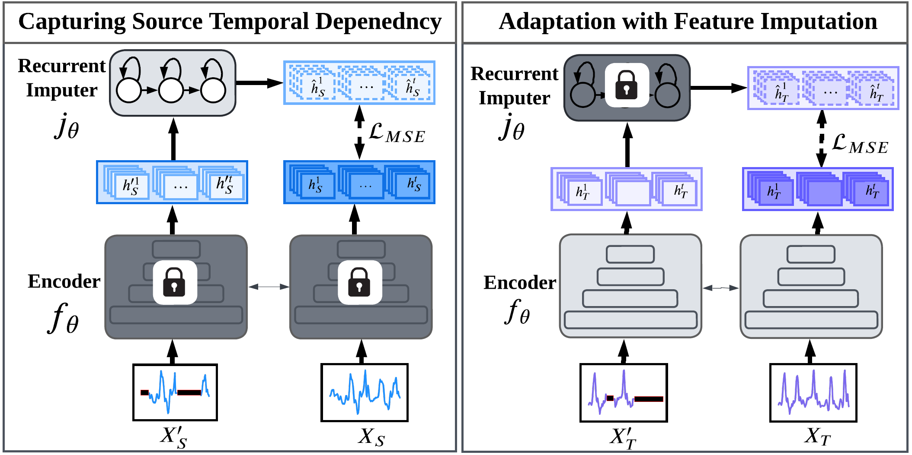

# [KDD 2023] Source-Free Domain Adaptation with Temporal Imputation for Time Series Data [[Paper](https://dl.acm.org/doi/10.1145/3580305.3599507)] [[Cite](#citation)]
#### *by: Mohamed Ragab, Emadeldeen Eldele,   Min Wu, Chuan-Sheng Foo, Xiaoli Li, Zhenghua Chen* <br/> 

## Accepted in the [29th SIGKDD Conference on Knowledge Discovery and Data Mining - Research Track](https://kdd.org/kdd2023/).


<p align="center">

</p>

## Requirmenets:
- Python3
- Pytorch==1.7
- Numpy==1.20.1
- scikit-learn==0.24.1
- Pandas==1.2.4
- skorch==0.10.0 
- openpyxl==3.0.7 (for classification reports)
- Wandb=0.12.7 (for sweeps)

## Datasets

### Available Datasets
We used four public datasets in this study. We also provide the **preprocessed** versions as follows:
- [SSC](https://researchdata.ntu.edu.sg/dataset.xhtml?persistentId=doi:10.21979/N9/UD1IM9)
- [UCIHAR](https://researchdata.ntu.edu.sg/dataset.xhtml?persistentId=doi:10.21979/N9/0SYHTZ)
- [MFD](https://researchdata.ntu.edu.sg/dataset.xhtml?persistentId=doi:10.21979/N9/PU85XN)


## Training procedure

The experiments are organised in a hierarchical way such that:
- Several experiments are collected under one directory assigned by `--experiment_description`.
- Each experiment could have different trials, each is specified by `--run_description`.

### Training a model

To train a model:

```
python trainers/train.py  --experiment_description exp1  \
                --run_description run_1 \
                --da_method MAPU \
                --dataset HAR \
                --backbone CNN \
                --num_runs 3 \
```
### Launching a sweep
Sweeps here are deployed on [Wandb](https://wandb.ai/), which makes it easier for visualization, following the training progress, organizing sweeps, and collecting results.

```
python trainers/sweep.py  --experiment_description exp1_sweep  \
                --run_description sweep_over_lr \
                --da_method MAPU \
                --dataset HAR \
                --backbone CNN \
                --num_runs 3\
                --num_sweeps 50 \
                --sweep_project_wandb MAPU_HAR
```
Upon the run, you will find the running progress in the specified project page in wandb.


## Results
- Each run will have all the cross-domain scenarios results in the format `src_to_trg_run_x`, where `x`
is the run_id (you can have multiple runs by assigning `--num_runs` arg). 
- Under each directory, you will find the classification report, a log file, checkpoint, 
and the different risks scores.
- By the end of the all the runs, you will find the overall average and std results in the run directory.


## Citation
If you found this work useful for you, please consider citing it.
```
@inproceedings{MAPU,
  author = {Ragab, Mohamed and Eldele, Emadeldeen and Wu, Min and Foo, Chuan-Sheng and Li, Xiaoli and Chen, Zhenghua},
  title = {Source-Free Domain Adaptation with Temporal Imputation for Time Series Data},
  year = {2023},
  isbn = {9798400701030},
  publisher = {Association for Computing Machinery},
  address = {New York, NY, USA},
  url = {https://doi.org/10.1145/3580305.3599507},
  doi = {10.1145/3580305.3599507},
  booktitle = {Proceedings of the 29th ACM SIGKDD Conference on Knowledge Discovery and Data Mining},
  pages = {1989–1998},
  numpages = {10},
  keywords = {time series data, temporal imputation, source-free domain adaptation, privacy preserving},
  location = {Long Beach, CA, USA},
  series = {KDD '23}
}
```


